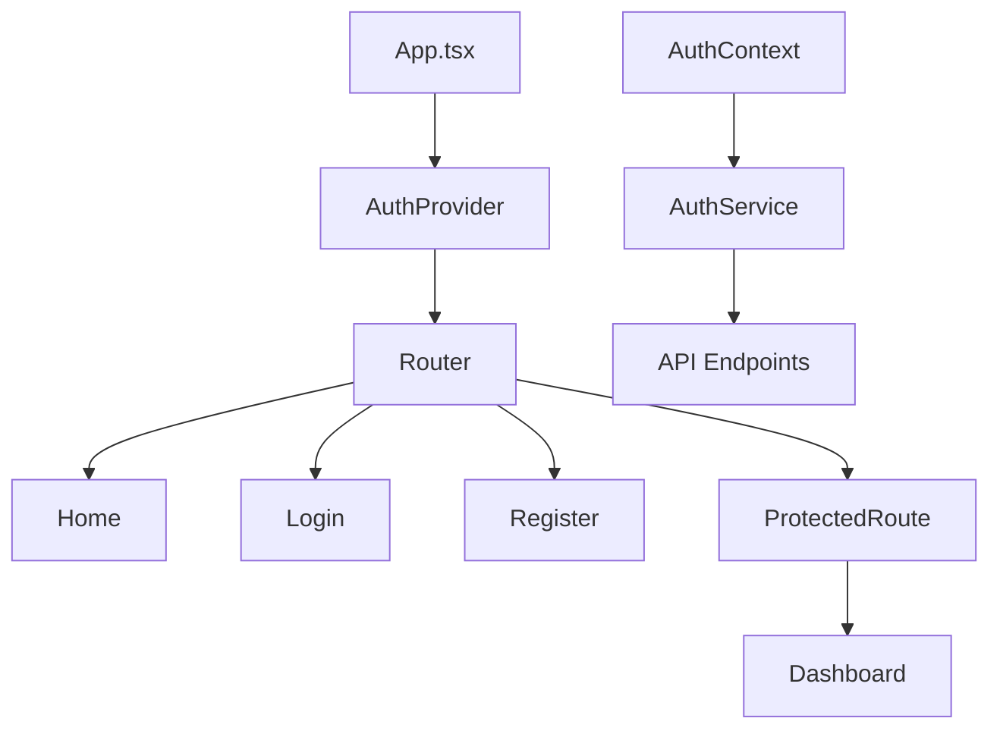
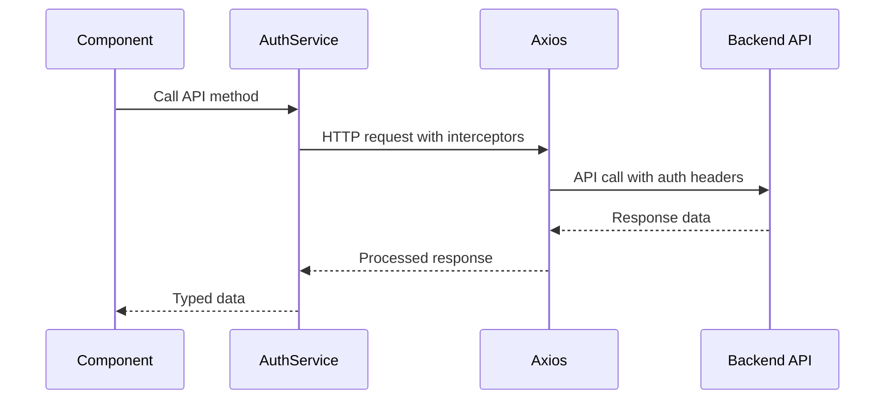

# NotebookLM Clone - Frontend


A modern, responsive frontend application for the NotebookLM clone built with React 19, TypeScript, and Tailwind CSS. Features a beautiful authentication interface, protected routes, and seamless API integration.

## � Table of Contents

- [Overview](#-overview)
- [Features](#-features)
- [Tech Stack](#-tech-stack)
- [Project Structure](#-project-structure)
- [Installation](#-installation)
- [Environment Setup](#-environment-setup)
- [Running the Application](#-running-the-application)
- [Components Architecture](#-components-architecture)
- [Authentication System](#-authentication-system)
- [API Integration](#-api-integration)
- [Styling Guide](#-styling-guide)
- [Responsive Design](#-responsive-design)
- [TypeScript Types](#-typescript-types)
- [Performance Optimization](#-performance-optimization)
- [Testing](#-testing)
- [Build and Deployment](#-build-and-deployment)
- [Troubleshooting](#-troubleshooting)
- [Contributing](#-contributing)

## 🌟 Overview

This frontend application serves as the user interface for the NotebookLM clone, providing a modern, intuitive experience for document management and AI-powered analysis. Built with the latest React 19 features and TypeScript for type safety, styled with Tailwind CSS for a beautiful, responsive design.

## 🚀 Features

### 🎨 User Interface
- **Modern Design** - Clean, intuitive interface with Tailwind CSS
- **Responsive Layout** - Optimized for desktop, tablet, and mobile devices
- **Dark/Light Theme Ready** - Built with theme support in mind
- **Smooth Animations** - Custom Tailwind animations for enhanced UX
- **Loading States** - Beautiful loading indicators and skeleton screens

### 🔐 Authentication
- **Login/Register Forms** - Complete authentication interface
- **Protected Routes** - Secure navigation with route guards
- **JWT Token Management** - Automatic token refresh and storage
- **User Profile** - Comprehensive user dashboard and profile management
- **Demo Credentials** - Quick testing with pre-filled demo data

### 📱 User Experience
- **API Health Monitoring** - Real-time backend connectivity status
- **Error Handling** - Graceful error states with user-friendly messages
- **Form Validation** - Client-side validation with immediate feedback
- **Accessibility** - ARIA labels and keyboard navigation support
- **Performance Optimized** - Code splitting and lazy loading

## 🛠 Tech Stack

| Technology | Version | Purpose |
|------------|---------|---------|
| **React** | 19.1.1 | UI library with latest features |
| **TypeScript** | 5.9.3 | Type safety and developer experience |
| **Tailwind CSS** | 3.4.0 | Utility-first CSS framework |
| **Vite** | 7.1.7 | Fast build tool and dev server |
| **React Router** | 7.9.4 | Client-side routing |
| **Axios** | 1.12.2 | HTTP client for API calls |
| **Lucide React** | 0.546.0 | Beautiful SVG icons |

## 📁 Project Structure

```
frontend/
├── 📄 package.json              # Dependencies and scripts
├── 📄 vite.config.ts           # Vite configuration
├── 📄 tailwind.config.js       # Tailwind CSS configuration
├── 📄 tsconfig.json            # TypeScript configuration
├── 📄 tsconfig.app.json        # App-specific TypeScript config
├── 📄 tsconfig.node.json       # Node-specific TypeScript config
├── 📄 postcss.config.js        # PostCSS configuration
├── 📄 eslint.config.js         # ESLint configuration
├── 📄 index.html               # HTML template
├── 📄 README.md                # This file
├── 📄 .env                     # Environment variables
├── 📄 .gitignore              # Git ignore rules
│
├── 📂 public/                  # Static assets
│   └── vite.svg                # Vite logo
│
└── 📂 src/                     # Source code
    ├── 📄 main.tsx             # Application entry point
    ├── 📄 App.tsx              # Main App component
    ├── 📄 index.css            # Global styles with Tailwind
    │
    ├── 📂 components/          # React components
    │   ├── Home.tsx            # Landing page with API health check
    │   ├── Login.tsx           # Login form component
    │   ├── Register.tsx        # User registration component
    │   ├── Dashboard.tsx       # User dashboard and profile
    │   └── ProtectedRoute.tsx  # Route protection wrapper
    │
    ├── 📂 contexts/            # React contexts
    │   └── AuthContext.tsx     # Authentication state management
    │
    ├── 📂 services/            # API services
    │   └── authService.ts      # Authentication API calls
    │
    └── 📂 types/               # TypeScript type definitions
        └── auth.ts             # Authentication-related types
```

## � Installation

### Prerequisites
- Node.js (version 18.x or higher)
- npm or yarn package manager

### Steps
1. **Navigate to frontend directory**
   ```bash
   cd frontend
   ```

2. **Install dependencies**
   ```bash
   npm install
   ```

3. **Set up environment variables**
   ```bash
   cp .env.example .env
   # Edit .env with your configuration
   ```

4. **Start development server**
   ```bash
   npm run dev
   ```

## 🔐 Environment Setup

Create a `.env` file in the frontend root:

```env
# API Configuration
VITE_API_BASE_URL=http://localhost:4000/api/v1
VITE_API_HEALTH_URL=http://localhost:4000/health

# Environment
VITE_NODE_ENV=development

# Optional: Analytics and monitoring
VITE_GA_TRACKING_ID=your-google-analytics-id
```

### Environment Variables Explained

| Variable | Description | Example |
|----------|-------------|---------|
| `VITE_API_BASE_URL` | Backend API base URL | `http://localhost:4000/api/v1` |
| `VITE_API_HEALTH_URL` | Health check endpoint | `http://localhost:4000/health` |
| `VITE_NODE_ENV` | Environment mode | `development` |

## 🚀 Running the Application

### Development Mode
```bash
npm run dev
```
- Runs on `http://localhost:5174` (or next available port)
- Hot reload enabled
- Development optimizations

### Preview Production Build
```bash
npm run build
npm run preview
```

### Available Scripts
```bash
npm run dev       # Start development server
npm run build     # Build for production
npm run preview   # Preview production build
npm run lint      # Run ESLint
```

## 🏗 Components Architecture

### Core Components Overview



### Component Details

#### 🏠 Home Component (`components/Home.tsx`)
**Purpose**: Landing page with feature showcase and API health monitoring

**Features**:
- Hero section with gradient background and animations
- Real-time API health status checker
- Feature cards with hover effects
- API endpoints documentation
- Quick start guide with interactive steps
- Responsive design with mobile optimization

**Key Functions**:
```typescript
const checkAPIHealth = async () => {
  // Tests backend connectivity
  // Updates UI with connection status
}
```

#### 🔐 Login Component (`components/Login.tsx`)
**Purpose**: User authentication interface

**Features**:
- Beautiful form with Tailwind styling
- Real-time validation feedback
- Password visibility toggle
- Demo credentials auto-fill
- Loading states and error handling
- Responsive design

**Form Fields**:
- Email (with validation)
- Password (with show/hide toggle)
- Demo credentials button
- Remember me (future feature)

#### 📝 Register Component (`components/Register.tsx`)
**Purpose**: New user registration interface

**Features**:
- Multi-step form validation
- Password confirmation
- Real-time feedback
- Error handling
- Success states

**Validation Rules**:
- Name: Required, minimum 2 characters
- Email: Valid email format
- Password: Minimum 6 characters
- Confirm Password: Must match password

#### 📊 Dashboard Component (`components/Dashboard.tsx`)
**Purpose**: User profile and account management

**Features**:
- User profile display and editing
- Statistics cards (notebooks, documents)
- Account details and verification status
- Authentication testing indicators
- Profile picture support (future)
- Settings management (future)

**Sections**:
1. Profile Information (editable)
2. Statistics Overview
3. Account Details
4. Authentication Status

#### 🛡 ProtectedRoute Component (`components/ProtectedRoute.tsx`)
**Purpose**: Route protection based on authentication status

**Logic**:
```typescript
if (!isAuthenticated) {
  return <Navigate to="/login" replace />;
}
return children;
```

### Context Architecture

#### 🔐 AuthContext (`contexts/AuthContext.tsx`)
**Purpose**: Global authentication state management

**State Management**:
```typescript
interface AuthContextType {
  user: User | null;
  isAuthenticated: boolean;
  isLoading: boolean;
  login: (email: string, password: string) => Promise<void>;
  register: (name: string, email: string, password: string) => Promise<void>;
  logout: () => Promise<void>;
  updateProfile: (data: UpdateProfileData) => Promise<void>;
}
```

**Features**:
- Persistent login state
- Automatic token refresh
- User profile management
- Loading and error states

## � Authentication System

### Registration Process
1. User fills registration form
2. Frontend validates input data
3. API call to `/api/v1/users/register`
4. JWT tokens stored in localStorage
5. User redirected to dashboard
6. Auth context updated

### Login Process
1. User enters credentials
2. Frontend validates form
3. API call to `/api/v1/users/login`
4. JWT tokens stored securely
5. User redirected to dashboard
6. Profile data fetched

### Token Management
```typescript
// Automatic token refresh on API calls
api.interceptors.response.use(
  (response) => response,
  async (error) => {
    if (error.response?.status === 401) {
      // Attempt token refresh
      // Retry original request
      // Redirect to login if refresh fails
    }
  }
);
```

### Protected Routes
```typescript
<Route 
  path="/dashboard" 
  element={
    <ProtectedRoute>
      <Dashboard />
    </ProtectedRoute>
  } 
/>
```

## 🎨 Styling Guide

### Tailwind CSS Configuration

#### Color Palette
```javascript
// tailwind.config.js
theme: {
  extend: {
    colors: {
      primary: {
        50: '#eff6ff',
        500: '#3b82f6',
        600: '#2563eb',
        700: '#1d4ed8',
      }
    }
  }
}
```

#### Custom Components
```css
/* index.css */
@layer components {
  .btn-primary {
    @apply bg-primary-600 hover:bg-primary-700 text-white font-medium py-2 px-4 rounded-lg transition-colors duration-200 focus:outline-none focus:ring-2 focus:ring-primary-500 focus:ring-offset-2 disabled:opacity-50 disabled:cursor-not-allowed;
  }
  
  .btn-secondary {
    @apply bg-white hover:bg-gray-50 text-gray-900 font-medium py-2 px-4 rounded-lg border border-gray-300 transition-colors duration-200;
  }
  
  .input-field {
    @apply block w-full px-3 py-2 border border-gray-300 rounded-lg shadow-sm placeholder-gray-400 focus:outline-none focus:ring-primary-500 focus:border-primary-500 transition-colors duration-200;
  }
  
  .card {
    @apply bg-white rounded-xl shadow-lg border border-gray-200 p-6;
  }
}
```

#### Custom Animations
```javascript
// tailwind.config.js
animation: {
  'fade-in': 'fadeIn 0.5s ease-in-out',
  'slide-up': 'slideUp 0.3s ease-out',
  'bounce-gentle': 'bounceGentle 2s infinite',
},
keyframes: {
  fadeIn: {
    '0%': { opacity: '0' },
    '100%': { opacity: '1' },
  },
  slideUp: {
    '0%': { transform: 'translateY(10px)', opacity: '0' },
    '100%': { transform: 'translateY(0)', opacity: '1' },
  }
}
```

### Design System

#### Spacing Scale
- `xs`: 0.5rem (8px)
- `sm`: 0.75rem (12px)
- `md`: 1rem (16px)
- `lg`: 1.25rem (20px)
- `xl`: 1.5rem (24px)

#### Typography Scale
- `text-sm`: 14px
- `text-base`: 16px
- `text-lg`: 18px
- `text-xl`: 20px
- `text-2xl`: 24px

#### Shadow System
- `shadow-sm`: Subtle shadow for cards
- `shadow-lg`: Prominent shadow for modals
- `shadow-xl`: Maximum shadow for overlays

## 📱 Responsive Design

### Breakpoint Strategy
```css
/* Mobile First Approach */
.responsive-component {
  @apply text-sm px-4;           /* Default (Mobile) */
  @apply sm:text-base sm:px-6;   /* Small (640px+) */
  @apply md:text-lg md:px-8;     /* Medium (768px+) */
  @apply lg:text-xl lg:px-10;    /* Large (1024px+) */
  @apply xl:text-2xl xl:px-12;   /* Extra Large (1280px+) */
}
```

### Component Responsiveness

#### Navigation
- **Mobile**: Hamburger menu (future)
- **Tablet**: Horizontal navigation
- **Desktop**: Full navigation with dropdowns

#### Forms
- **Mobile**: Single column layout
- **Tablet**: Two-column where appropriate
- **Desktop**: Optimized spacing and sizing

#### Cards and Grids
- **Mobile**: Single column stacking
- **Tablet**: 2-column grid
- **Desktop**: 3+ column grid with optimal spacing

## 🔷 TypeScript Types

### Authentication Types (`types/auth.ts`)

```typescript
// User interface
export interface User {
  _id: string;
  name: string;
  email: string;
  avatar?: string;
  isEmailVerified: boolean;
  totalNotebooks: number;
  totalDocuments: number;
  plan: 'free' | 'premium' | 'enterprise';
  createdAt: string;
  updatedAt: string;
}

// Authentication responses
export interface LoginResponse {
  user: User;
  accessToken: string;
  refreshToken: string;
}

export interface RegisterData {
  name: string;
  email: string;
  password: string;
}

export interface UpdateProfileData {
  name?: string;
  email?: string;
}

// API response wrapper
export interface ApiResponse<T> {
  statusCode: number;
  data: T;
  message: string;
  success: boolean;
}

// Health check response
export interface HealthData {
  message: string;
  timestamp: string;
  version: string;
}

// User statistics
export interface UserStats {
  totalNotebooks: number;
  totalDocuments: number;
  recentActivity: ActivityItem[];
}
```

### Component Props Types

```typescript
// Protected Route props
interface ProtectedRouteProps {
  children: React.ReactNode;
}

// Form field props
interface FormFieldProps {
  label: string;
  name: string;
  type: 'text' | 'email' | 'password';
  required?: boolean;
  placeholder?: string;
  icon?: React.ReactNode;
}

// Button props
interface ButtonProps {
  variant: 'primary' | 'secondary' | 'danger';
  size: 'sm' | 'md' | 'lg';
  loading?: boolean;
  disabled?: boolean;
  children: React.ReactNode;
  onClick?: () => void;
}
```

## ⚡ Performance Optimization

### Code Splitting
```typescript
// Lazy loading components
const Dashboard = React.lazy(() => import('./components/Dashboard'));
const Profile = React.lazy(() => import('./components/Profile'));

// Suspense wrapper
<Suspense fallback={<LoadingSpinner />}>
  <Routes>
    <Route path="/dashboard" element={<Dashboard />} />
  </Routes>
</Suspense>
```

### Bundle Optimization
```typescript
// vite.config.ts
export default defineConfig({
  build: {
    rollupOptions: {
      output: {
        manualChunks: {
          vendor: ['react', 'react-dom'],
          router: ['react-router-dom'],
          icons: ['lucide-react'],
        },
      },
    },
  },
});
```

### Image Optimization
```typescript
// Lazy loading images


// WebP format with fallback
<picture>
  <source srcSet="image.webp" type="image/webp" />
  
</picture>
```

### Caching Strategy
```typescript
// Service Worker for API caching
if ('serviceWorker' in navigator) {
  navigator.serviceWorker.register('/sw.js');
}

// Memory caching for frequently accessed data
const cache = new Map();
export const getCachedData = (key: string) => {
  return cache.get(key);
};
```

## 🧪 Testing

### Testing Setup (Future Implementation)

#### Unit Testing with Vitest
```typescript
// vite.config.ts
export default defineConfig({
  test: {
    environment: 'jsdom',
    setupFiles: ['./src/test/setup.ts'],
  },
});
```

#### Component Testing
```typescript
// Example test file
import { render, screen, fireEvent } from '@testing-library/react';
import { Login } from '../components/Login';

describe('Login Component', () => {
  test('renders login form', () => {
    render(<Login />);
    expect(screen.getByText('Welcome Back')).toBeInTheDocument();
  });

  test('validates email input', async () => {
    render(<Login />);
    const emailInput = screen.getByPlaceholderText('Enter your email');
    fireEvent.change(emailInput, { target: { value: 'invalid-email' } });
    // Assert validation message
  });
});
```

#### E2E Testing with Playwright
```typescript
// e2e/auth.spec.ts
import { test, expect } from '@playwright/test';

test('user can login successfully', async ({ page }) => {
  await page.goto('/login');
  await page.fill('[name="email"]', 'test@example.com');
  await page.fill('[name="password"]', 'password123');
  await page.click('button[type="submit"]');
  await expect(page).toHaveURL('/dashboard');
});
```

## 🚀 Build and Deployment

### Production Build
```bash
# Build for production
npm run build

# Output directory: dist/
# Optimized and minified files
# Static assets with cache headers
```

### Build Analysis
```bash
# Analyze bundle size
npm run build -- --analyze

# Preview production build
npm run preview
```

### Deployment Options

#### Vercel Deployment
```bash
# Install Vercel CLI
npm install -g vercel

# Deploy
vercel

# Set environment variables in dashboard
```

#### Netlify Deployment
```bash
# Build command: npm run build
# Publish directory: dist
# Environment variables in dashboard
```

#### Static Hosting
```bash
# Any static hosting service
# Upload dist/ folder contents
# Configure SPA redirects for React Router
```

### Environment-Specific Builds

#### Development
```env
VITE_API_BASE_URL=http://localhost:4000/api/v1
VITE_NODE_ENV=development
```

#### Staging
```env
VITE_API_BASE_URL=https://api-staging.example.com/api/v1
VITE_NODE_ENV=staging
```

#### Production
```env
VITE_API_BASE_URL=https://api.example.com/api/v1
VITE_NODE_ENV=production
```

## � API Integration

### Service Architecture

#### AuthService (`services/authService.ts`)
**Purpose**: Centralized API communication

**Methods**:
```typescript
class AuthService {
  // Authentication
  login(email: string, password: string): Promise<LoginResponse>
  register(name: string, email: string, password: string): Promise<User>
  logout(): Promise<void>
  refreshToken(): Promise<TokenResponse>
  
  // User Management
  getCurrentUser(): Promise<User>
  updateProfile(data: UpdateProfileData): Promise<User>
  getUserStats(): Promise<UserStats>
  
  // Health Check
  testConnection(): Promise<HealthData>
}
```

### API Request Flow



### Request Interceptors
```typescript
// Automatic token attachment
axios.interceptors.request.use((config) => {
  const token = localStorage.getItem('accessToken');
  if (token) {
    config.headers.Authorization = `Bearer ${token}`;
  }
  return config;
});

// Automatic token refresh
axios.interceptors.response.use(
  (response) => response,
  async (error) => {
    if (error.response?.status === 401) {
      await refreshToken();
      return axios.request(error.config);
    }
    throw error;
  }
);
```

## � Troubleshooting

### Common Issues

#### Build Errors
```bash
# Clear cache and reinstall
rm -rf node_modules package-lock.json
npm install

# Clear Vite cache
rm -rf .vite
npm run dev
```

#### TypeScript Errors
```bash
# Check for type errors
npx tsc --noEmit

# Update type definitions
npm update @types/react @types/react-dom
```

#### Tailwind CSS Not Working
```bash
# Verify PostCSS configuration
# Check tailwind.config.js content paths
# Ensure @tailwind directives in index.css
```

#### API Connection Issues
```bash
# Check environment variables
# Verify backend server is running
# Check CORS configuration
# Inspect network tab in browser
```

### Development Tips

#### Hot Reload Issues
```typescript
// Force refresh on file change
if (import.meta.hot) {
  import.meta.hot.accept(() => {
    window.location.reload();
  });
}
```

#### State Debugging
```typescript
// React Developer Tools
// Redux DevTools (if using Redux)
// Browser console logging

console.log('Auth State:', { user, isAuthenticated });
```

#### Performance Debugging
```typescript
// React Profiler
import { Profiler } from 'react';

<Profiler id="App" onRender={(id, phase, actualDuration) => {
  console.log({ id, phase, actualDuration });
}}>
  <App />
</Profiler>
```

## 🤝 Contributing

### Development Guidelines

#### Code Style
- Use **TypeScript** for all new components
- Follow **React best practices** with hooks
- Use **functional components** over class components
- Implement **proper error boundaries**
- Add **proper TypeScript types**

#### Component Guidelines
```typescript
// Component structure
export const ComponentName: React.FC<ComponentProps> = ({ 
  prop1, 
  prop2 
}) => {
  // State and hooks
  const [state, setState] = useState();
  
  // Event handlers
  const handleEvent = useCallback(() => {
    // Handler logic
  }, [dependencies]);
  
  // Effects
  useEffect(() => {
    // Effect logic
  }, [dependencies]);
  
  // Render
  return (
    <div className="component-container">
      {/* Component JSX */}
    </div>
  );
};
```

#### Styling Guidelines
- Use **Tailwind CSS** classes over custom CSS
- Create **reusable component classes** in index.css
- Follow **mobile-first** responsive design
- Maintain **consistent spacing** and typography
- Use **semantic color names** from theme

#### Git Workflow
```bash
# Create feature branch
git checkout -b feature/component-name

# Make changes with descriptive commits
git commit -m "feat: add user profile component"
git commit -m "style: update responsive design for mobile"
git commit -m "fix: resolve authentication state bug"

# Push and create PR
git push origin feature/component-name
```

### Pull Request Checklist
- [ ] Code follows TypeScript best practices
- [ ] Components are properly typed
- [ ] Responsive design implemented
- [ ] Accessibility considerations addressed
- [ ] No console errors or warnings
- [ ] Build passes successfully
- [ ] Documentation updated if needed

## � Accessibility Features

### ARIA Support
```typescript
// Proper ARIA labels
<button 
  aria-label="Close dialog"
  aria-pressed={isOpen}
  onClick={handleClose}
>
  <X className="w-5 h-5" />
</button>

// Form accessibility
<input
  type="email"
  id="email"
  aria-describedby="email-error"
  aria-invalid={!!errors.email}
/>
<div id="email-error" role="alert">
  {errors.email}
</div>
```

### Keyboard Navigation
```typescript
// Focus management
const handleKeyDown = (e: KeyboardEvent) => {
  if (e.key === 'Escape') {
    closeModal();
  }
  if (e.key === 'Enter' || e.key === ' ') {
    handleAction();
  }
};

// Focus trap for modals
<div
  role="dialog"
  aria-modal="true"
  onKeyDown={handleKeyDown}
>
  {/* Modal content */}
</div>
```

### Screen Reader Support
```typescript
// Live regions for dynamic content
<div aria-live="polite" aria-atomic="true">
  {statusMessage}
</div>

// Skip links
<a href="#main-content" className="sr-only focus:not-sr-only">
  Skip to main content
</a>
```

## � Analytics Integration

### Google Analytics Setup
```typescript
// gtag.ts
export const GA_TRACKING_ID = import.meta.env.VITE_GA_TRACKING_ID;

export const pageview = (url: string) => {
  if (typeof window.gtag !== 'undefined') {
    window.gtag('config', GA_TRACKING_ID, {
      page_path: url,
    });
  }
};

export const event = (action: string, parameters: any) => {
  if (typeof window.gtag !== 'undefined') {
    window.gtag('event', action, parameters);
  }
};
```

### Custom Event Tracking
```typescript
// Track user interactions
const trackButtonClick = (buttonName: string) => {
  event('click', {
    event_category: 'engagement',
    event_label: buttonName,
  });
};

// Track page views in Router
useEffect(() => {
  pageview(location.pathname);
}, [location]);
```

## � Future Enhancements

### Planned Features
- [ ] **Dark/Light Theme** toggle
- [ ] **Internationalization** (i18n) support
- [ ] **Progressive Web App** (PWA) features
- [ ] **Offline support** with service workers
- [ ] **Push notifications**
- [ ] **Advanced form validation** library
- [ ] **Drag and drop** file upload
- [ ] **Real-time updates** with WebSocket
- [ ] **Advanced search** interface
- [ ] **Mobile app** with React Native

### Technical Improvements
- [ ] **State management** with Zustand or Redux Toolkit
- [ ] **Testing suite** with Vitest and Playwright
- [ ] **Storybook** for component documentation
- [ ] **Bundle analyzer** for optimization
- [ ] **Error monitoring** with Sentry
- [ ] **Performance monitoring**
- [ ] **A/B testing** framework
- [ ] **Component library** extraction

---

## 📞 Support

For frontend-specific issues:
- **GitHub Issues**: [Frontend Issues](https://github.com/sujalkamble007/NoteBookLm/issues?q=label%3Afrontend)
- **Component Documentation**: Check component files for inline documentation
- **Styling Issues**: Refer to Tailwind CSS documentation

## 📄 License

This frontend application is part of the NotebookLM Clone project and is licensed under the **ISC License**.

---

**Frontend built with ❤️ by [Sujal Kamble](https://github.com/sujalkamble007)**

*Last Updated: October 20, 2025*
